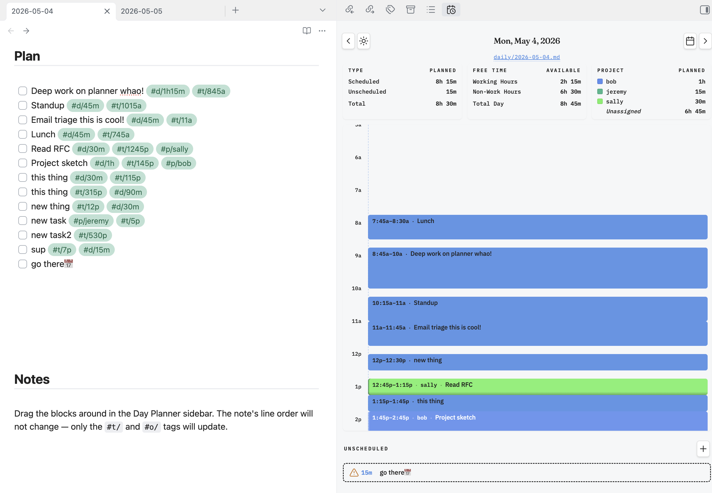

# Today

Plan your day inside your daily note. Today is an Obsidian sidebar that turns hashtag-annotated tasks into a draggable timeline — and writes every change back to the same task lines you started from. The note stays the source of truth; the timeline is just a view of it.

Built to coexist with the Tasks plugin. Tasks are standard markdown checklist lines (`- [ ] ...`) and Today only adds the `#d/`, `#t/`, `#o/`, and `#p/` hashtags.



## Why

Most calendar plugins maintain a separate database, generate scheduled blocks in a sidecar file, or rewrite your notes when you drag things around. Today does the opposite:

- **Your note doesn't move.** Drag, resize, reorder — line order in the file never changes. Today only edits the hashtags on the line.
- **The hashtags are the schema.** No frontmatter, no JSON, no hidden state. Read your daily note in any other tool and your plan is right there as plain text.
- **Works with what you already have.** Drop it on top of your existing Tasks-plugin workflow.

## Tag grammar

| Tag | Meaning | Examples |
|---|---|---|
| `#d/<dur>` | Duration | `#d/30m`, `#d/2h`, `#d/1h30m`, `#d/90m` |
| `#t/<time>` | Start time (12-hour, am/pm) | `#t/9a`, `#t/930a`, `#t/130p`, `#t/12p` |
| `#o/<n>` | Order in the unscheduled list (managed by the plugin) | `#o/3` |
| `#p/<name>` | Project — drives color grouping in the timeline | `#p/sally`, `#p/work-1` |

A task needs at least `#d/` to appear in the planner. Add `#t/` to schedule it; without `#t/` it shows in the unscheduled list. The `#o/` tag is rewritten automatically as you reorder unscheduled cards — you usually don't type it.

Decimals (`#d/1.5h`) and colons (`#t/10:30a`) are not supported on purpose — use `#d/1h30m` and `#t/1030a`. Single-pattern regexes make the parser fast and the rewrites unambiguous.

All tag prefixes (`d`, `t`, `o`, `p`) are configurable in settings if they collide with tags you already use.

## Usage

The sidebar shows two sections:

1. **Today's daily note** — always visible. Resolves the path via the core Daily Notes plugin if it's enabled, otherwise via the format/folder fallback in settings.
2. **The currently active note** — only when it's not today's daily note. Lets you plan tomorrow, or pull a project note's tasks into a timeline view.

Each section has its own scheduled / unscheduled / free-time totals.

**Mouse:**

- Drag a block in the timeline to a new slot → rewrites `#t/`.
- Drag a block out into the unscheduled list → strips `#t/`, appends `#o/<next>`.
- Drag a card in the unscheduled list above/below another → renumbers `#o/` for affected cards.
- Drag the bottom edge of a block → rewrites `#d/`.
- Click any block or card → opens the source line in the editor.

The plugin never moves lines in the file. The order you see in the UI is derived from the tags it reads.

## Install

### From the community directory (after release)

In Obsidian: **Settings → Community plugins**, turn off Restricted Mode if needed, **Browse**, search for "Today", **Install**, then **Enable**.

### Manual install

Download `main.js`, `manifest.json`, and `styles.css` from the [latest release](https://github.com/bryanwhiting/obsidian-today/releases) and drop them into `<your-vault>/.obsidian/plugins/today/`. Then in Obsidian: **Settings → Community plugins → Reload**, and enable **Today**.

Or clone the repo directly:

```bash
cd /path/to/your-vault/.obsidian/plugins
git clone https://github.com/bryanwhiting/obsidian-today today
```

The committed `main.js` is the prebuilt bundle — no build step needed.

## Settings

- **Defaults:** snap interval (default 15 min), pixels per minute (default 1), default duration for tasks with `#t/` but no `#d/`, and the prefix letters for `#d/`, `#t/`, `#o/`.
- **Templating:** daily-note format and folder fallback (used only if core Daily Notes is disabled), and an optional template file copied verbatim into newly created daily notes.
- **Day config:** visible start/end hour (default 6–23), working-hour window, and wake/sleep window — used for the "working hours open" and "day available" stats.
- **Projects:** prefix for the project tag, plus a list of project → color pin overrides. Projects without a pin get a distinct auto-assigned color, cycled alphabetically.

## Project layout

- `src/parser.ts` — tag regexes, line rewriters
- `src/scheduler.ts` — overlap layout for side-by-side blocks
- `src/view.ts` — sidebar `ItemView`, drag-drop, resize
- `src/dailyNote.ts` — resolves today's daily note (reads core Daily Notes settings)
- `src/colors.ts` — project color resolver
- `src/settings.ts` — settings tab
- `src/main.ts` — plugin entry, ribbon, commands, settings load/save
- `src/styles.src.css` — Tailwind source compiled to `styles.css`

## Development

```bash
npm install
npm run dev        # esbuild watch — rebuilds main.js on every change
npm run watch:css  # Tailwind watch — rebuilds styles.css on every change
npm run build      # production build (CSS + JS)
npm run typecheck
```

After each rebuild, run **Reload app without saving** in Obsidian (Cmd/Ctrl+P → "Reload"), or toggle the plugin off and back on.

## License

MIT — see [LICENSE](./LICENSE).
